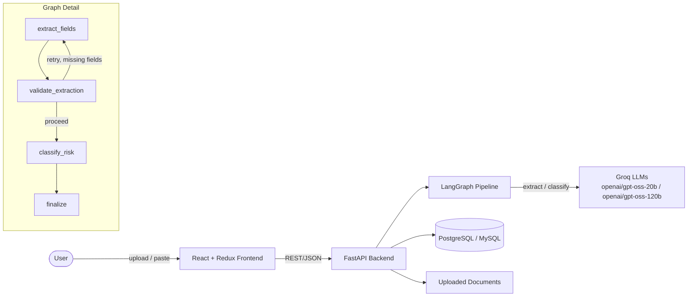

# AI-Powered Customer Complaint Management System

AI-assisted intake and triage for pharmaceutical quality-assurance complaints. Upload or paste a
complaint document; a LangGraph-orchestrated pipeline extracts structured fields and an initial
risk assessment into an editable review form — human-in-the-loop by design, never auto-saved
without review.

Built for the AIVOA AI Product Engineer internship assignment.

## Features

- **AI Complaint Intake Assistant** — drag-and-drop or paste a complaint email/document (PDF,
  DOCX, TXT, EML); a LangGraph pipeline extracts structured fields automatically
- **Human-in-the-loop review** — every AI-populated field is editable before saving; nothing is
  persisted without confirmation
- **AI Copilot Risk Assessment** — severity/priority classification with a visible confidence
  score and plain-language reasoning, plus a deterministic safety-net rule for safety-critical
  keywords
- **Batch-aware priority escalation** — a second complaint on a batch that already has one on
  file automatically escalates priority
- **Full audit trail** — every AI extraction attempt is recorded separately from the confirmed
  complaint record

## Architecture



See [`docs/architecture.md`](docs/architecture.md) for the full design writeup — database schema,
API contracts, LangGraph node/edge design, prompts, and UI direction.

## Technology Stack

| Layer | Technology |
|---|---|
| Frontend | React 18, Redux Toolkit, TypeScript, Vite |
| Backend | FastAPI, SQLAlchemy, Pydantic |
| AI Orchestration | LangGraph, LangChain |
| LLM Provider | Groq (`openai/gpt-oss-20b`, `openai/gpt-oss-120b` — see note below) |
| Database | PostgreSQL (or MySQL) |
| Deployment | Docker, Docker Compose |

> **Note on model choice:** the assignment originally specified `gemma2-9b-it` and
> `llama-3.3-70b-versatile`. Groq deprecated `gemma2-9b-it` on 10/08/2025 and is deprecating
> `llama-3.3-70b-versatile` on 08/16/2026, so the codebase now defaults to their currently
> recommended, non-deprecated replacements (`openai/gpt-oss-20b` and `openai/gpt-oss-120b`).
> Worth mentioning proactively if asked about the tech stack in an interview — see
> `console.groq.com/docs/deprecations` for the current state if this changes again.


## Project Structure

```
complaint-management-system/
├── .github/workflows/       # CI: lint, backend tests, frontend build/tests
├── backend/                 # FastAPI + LangGraph
│   └── app/
│       ├── ai/               # LangGraph state, nodes, prompts, graph wiring
│       ├── api/               # HTTP routers, dependency injection
│       ├── core/               # logging, exceptions
│       ├── db/                   # engine, session
│       ├── models/                 # SQLAlchemy ORM
│       ├── repositories/             # DB query layer
│       ├── schemas/                    # Pydantic contracts
│       └── services/                     # business logic
├── frontend/                # React + Redux + Vite
│   └── src/
│       ├── api/               # backend client
│       ├── components/          # ComplaintForm, AIAssistantPanel, common/
│       ├── hooks/                 # typed Redux hooks
│       ├── pages/                   # ComplaintIntakePage
│       ├── store/                     # Redux slices
│       └── types/                       # shared TS types
├── docs/                     # architecture, deployment, git workflow docs
├── sample_data/              # fabricated complaint documents for demos
├── docker-compose.yml
└── README.md
```

## Installation

### Prerequisites
- Docker + Docker Compose (recommended), **or** Python 3.12+ and Node 20+ for local dev
- A [Groq API key](https://console.groq.com)

### Backend Setup
```bash
cd backend
python -m venv venv && source venv/bin/activate
pip install -r requirements.txt
cp .env.example .env   # fill in GROQ_API_KEY and DATABASE_URL
uvicorn app.main:app --reload
```

### Frontend Setup
```bash
cd frontend
npm install
npm run dev
```

### Environment Variables

See [`backend/.env.example`](backend/.env.example) for the full list. Key variables:

| Variable | Description |
|---|---|
| `GROQ_API_KEY` | Your Groq API key (required) |
| `DATABASE_URL` | SQLAlchemy connection string (Postgres or MySQL) |
| `GROQ_EXTRACTION_MODEL` | Defaults to `openai/gpt-oss-20b` (Groq deprecated the assignment-specified gemma2-9b-it on 10/08/2025) |
| `GROQ_REASONING_MODEL` | Defaults to `openai/gpt-oss-120b` (Groq is deprecating llama-3.3-70b-versatile on 08/16/2026) |

## Running Locally (Docker)

```bash
echo "GROQ_API_KEY=your_key_here" > .env
docker compose up --build
```
- Frontend: http://localhost
- API docs (Swagger): http://localhost:8000/docs

## Database Setup

Tables are auto-created on backend startup for local/demo use (`Base.metadata.create_all` in
`app/main.py`). This is a demo convenience, not a production migration strategy — see
[`docs/architecture.md`](docs/architecture.md) for the full schema and the note on why Alembic
would replace this in production.

## Running AI Services

The LangGraph pipeline runs in-process inside the FastAPI backend — there's no separate AI
microservice to stand up. It's invoked automatically whenever `/api/v1/complaints/extract` is
called. See [`docs/architecture.md`](docs/architecture.md) for the node/edge design and prompts.

## Screenshots

> _Add screenshots of the running app here before submission — the two-pane intake form and the
> extraction-in-progress state make the strongest demo images._

`docs/screenshots/form-empty.png`
`docs/screenshots/form-populated.png`
`docs/screenshots/extraction-in-progress.png`

## Demo Video

> _Add links to both required videos here before submission:_
> - **Feature demo** (5–10 min): `<link>`
> - **Code walkthrough** (5–10 min): `<link>`

## API Documentation

Interactive Swagger docs are auto-generated by FastAPI at `/docs` when the backend is running.
Endpoint summary:

| Method | Endpoint | Purpose |
|---|---|---|
| `POST` | `/api/v1/complaints/extract` | Run AI extraction on an uploaded file or pasted text |
| `POST` | `/api/v1/complaints` | Save a reviewed/confirmed complaint |
| `GET` | `/api/v1/complaints/{id}` | Fetch a single complaint |
| `GET` | `/api/v1/complaints` | List/filter complaints |
| `POST` | `/api/v1/complaints/{id}/completeness-check` | Check whether a saved complaint has all required fields |
| `POST` | `/api/v1/complaints/{id}/summary` | Generate a QA-oriented complaint summary |
| `POST` | `/api/v1/complaints/{id}/duplicate-check` | Find possible duplicate complaints on the same product |
| `GET` | `/health` | Health check |

Full request/response schemas are in [`docs/architecture.md`](docs/architecture.md#step-5--api-design).

## AI Bonus Features

Three of the assignment's six optional bonus features are implemented, on top of the required AI
Risk Classification — which itself was **improved** (per the assignment's Phase 12 instruction to
improve rather than duplicate) with a dedicated on-demand re-assessment endpoint. All four are
on-demand: they run after a complaint is saved, triggered from the **AI Insights** panel that
appears below the form once you save a complaint, not automatically as part of intake.

| Feature | How it works | Why this approach |
|---|---|---|
| **Completeness Checker** | Deterministic required-fields check, plus an optional LLM pass for qualitative warnings (e.g. "description looks thin for a Critical complaint") | The core is/isn't-complete answer is correctness-critical — a rule-based check is 100% reliable where an LLM guess wouldn't be. The optional LLM pass degrades gracefully to "no warnings" on any failure rather than blocking the result |
| **Complaint Summary** | Single LLM call (same `call_llm_for_json` pattern as extraction/risk classification), explicitly instructed to return `"insufficient_information"` rather than fabricate | Genuinely benefits from LLM prose generation, unlike completeness |
| **Duplicate Complaint Detection** | Queries other complaints on the same product, scores description similarity with `difflib.SequenceMatcher`, boosts the score if it's also the same batch | Deliberately not embeddings-based — a free, deterministic similarity score is good enough at this data scale; see the trade-off note in `complaint_service.check_duplicates` for when embeddings would be worth the added infrastructure |
| **Risk Assessment (re-run)** | Re-invokes the same `classify_risk` node used at intake, against the complaint's *current* saved data — useful if the description was edited after initial extraction. Returns reasoning and a `business_rule_applied` flag the original intake response never persisted | "Improve, don't duplicate" — same node, same safety-keyword escalation rule (verified by test to override the LLM even when the model itself gets it wrong), new on-demand retrieval path |

**Not yet implemented** (designed in `docs/architecture.md` Step 12, same extension pattern as
the four above would apply): Root Cause Recommendation, CAPA Recommendation.

## Deployment

See [`docs/DEPLOYMENT.md`](docs/DEPLOYMENT.md) for platform-specific guides (Vercel, Render,
Railway, and Docker).

## Future Improvements

- Implement remaining bonus AI features (Root Cause Recommendation, CAPA Recommendation) —
  designed in `docs/architecture.md` Step 12, not yet built
- Replace `create_all` with Alembic migrations
- Add authentication (routers are already structured to accept a `Depends(get_current_user)`)
- Add a complaint list/detail view with `react-router`
- Semantic-similarity duplicate detection via embeddings (current implementation uses
  `difflib.SequenceMatcher` — see `docs/architecture.md` and `AI Bonus Features` above for the
  trade-off reasoning)


## License

MIT — see [`LICENSE`](LICENSE).

## Author

Built as part of the AIVOA AI Product Engineer internship assignment.

## Acknowledgements

- [LangGraph](https://langchain-ai.github.io/langgraph/) for the agent orchestration model
- [Groq](https://groq.com) for fast LLM inference
- [FastAPI](https://fastapi.tiangolo.com) and [Vite](https://vitejs.dev) for the dev experience
