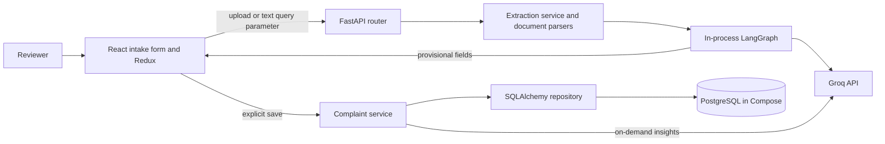
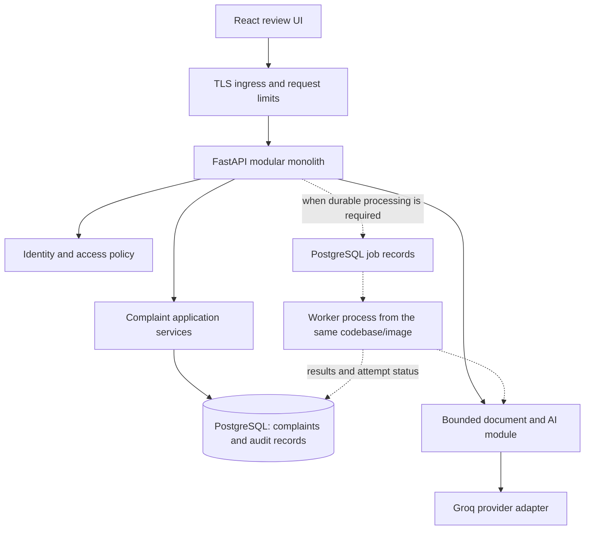
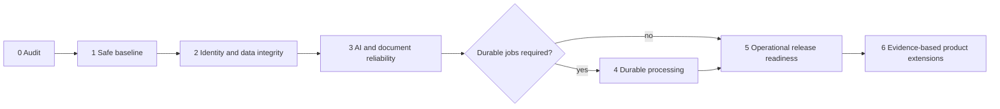

# Engineering Audit

Audit date: 2026-10-04 (Asia/Calcutta). Repository: `Sodhani0007/Complaint-Management-System`. Audited branch: `feature/production-engineering-upgrade`. Baseline commit: `6fbe2ba` (`docs: add engineering project status`).

**Assessment:** This is a useful complaint-intake prototype with a sound starting structure for a modular monolith. It is not yet ready for public access or production complaint records. The most urgent gaps are unauthenticated access, unreliable audit provenance, non-atomic persistence, insufficient AI validation, and unsafe production defaults. A service decomposition or framework rewrite would not solve these problems.

This document is the only deliverable of Phase 0. All implementation described below is proposed future work. No application changes, dependency installations, migrations, deployments, or Phase 1 work were performed.

## Audit basis and verification limits

- Inspected all tracked application modules, both test files, dependency manifests and the frontend lockfile, Docker and nginx configuration, GitHub Actions, environment examples, documentation, and sample fixtures. The PDF fixture was inspected as a binary PDF fixture, not visually rendered or processed through the application parser.
- Inspected the local Git history and branch topology: 25 reachable commits, a non-shallow checkout, no local tags, and no merge commits in the available history. The working tree was initially clean. Remote-tracking references are local snapshots; no fetch was performed.
- Captured SHA-256 hashes of all 99 tracked files before creating this document for the final unchanged-file check.
- Existing frontend tooling successfully ran `node node_modules/typescript/bin/tsc --noEmit --incremental false` from `frontend/` (exit 0). This verifies type checking in the installed environment, not a clean dependency installation, browser behavior, or the production build.
- Backend execution was not available: the existing `backend/venv/Scripts/python.exe` was initially blocked by the sandbox; the approved retry identified Python 3.14.2 and failed to import `pytest`. CI and the Dockerfile specify Python 3.12. No packages were installed. **The backend tests were inspected, not run.**
- There are 22 test functions in the source: 9 API tests and 13 bonus-feature tests. This is a source inventory, not a passing-test count or coverage measurement. Previous commit messages claiming passing tests are historical statements, not verification of this checkout.
- No production DB, live Groq call, Docker deployment, browser/E2E session, vulnerability scanner, benchmark, or AI evaluation was run. No current throughput, latency distribution, availability, coverage percentage, extraction accuracy, or model-quality metric is available.
- GitHub branch protection, required checks, private security reporting, actual Actions results, releases, deployed environments, provider configuration, and backups were not verified remotely. Their absence from source is not proof they are disabled externally.
- The root `.env` exists and is ignored by Git. Its secret values were not printed or used. Environment examples contain placeholders/demo credentials. Filename history for `.env`, `backend/.env`, and `frontend/.env` returned no commits; this is not a comprehensive historical secret scan.
- Findings are based on executable code rather than design prose. Runtime consequences inferred from code are identified as such. References below use repository-relative paths and symbols; links open the underlying evidence.

Recommendation IDs `R01`–`R25` are defined in section 18. Each specifies the problem, expected benefit, complexity, and necessity. Section 20 records the risks and safeguards for every recommendation.

## 1. Current architecture

### Components and boundaries

| Component | Verified implementation | Important boundary |
|---|---|---|
| Frontend | React 18, TypeScript, Vite, Redux Toolkit, Axios; one intake page | No login, route-based complaint browser, or durable draft storage |
| HTTP API | FastAPI with `/api/v1/complaints` router and dependency providers | No authentication or authorization dependency |
| Application services | `ComplaintService`, `ExtractionService`, format parsers | Existing orchestration boundary is useful; transactions currently live inside repository methods |
| Persistence | Synchronous SQLAlchemy sessions and five ORM tables | PostgreSQL 16 in Compose; SQLite in tests; startup `create_all`, no migration revisions |
| AI | In-process synchronous LangGraph and LangChain Groq client | No worker, durable job, checkpoint storage, or independent AI service |
| Delivery | Vite development proxy; nginx serves compiled frontend and proxies `/api/` in Docker | Separate frontend/backend containers are deployment components, not domain microservices |

The extraction path parses bytes in memory, calls `complaint_graph.invoke`, and returns a newly generated UUID plus provisional fields. It does **not** save a document or extraction record. On save, the service resolves/creates a product and batch, counts prior batch complaints, applies priority escalation, commits the complaint, and optionally commits a client-supplied snapshot as a second transaction.

The graph is `extract_fields -> validate_extraction -> retry extraction or classify_risk -> finalize`. Missing required fields can cause two graph retries, for three extraction passes total. Parsing occurs before the graph. Completeness, summary, duplicates, and reassessment are separate post-save calls, not graph branches in intake.

Evidence: [API dependency providers](../backend/app/api/deps.py), [complaint service](../backend/app/services/complaint_service.py), [extraction service](../backend/app/services/extraction_service.py), [graph](../backend/app/ai/graph.py), [Compose](../docker-compose.yml).

## 2. Existing functionality

### User and document flows

- Manual complaint entry, AI-assisted upload/paste, editable extracted fields, explicit save, reset, loading indicators, errors, and a saved-record ID.
- Text-based PDF extraction through `pypdf`; DOCX paragraph extraction through `python-docx`; UTF-8 TXT decoding with replacement; EML sender, subject, and plain-text body extraction through the standard library.
- No OCR; no image parsing; no DOCX table/header extraction; no HTML-only email body fallback or attachment parsing. No source download, persistent file storage, or document management flow.
- A deterministic keyword override can force AI risk output to Critical/High. Save-time priority escalates one step if an existing batch has a prior complaint and a priority was supplied.
- Post-save completeness checking, an optional qualitative LLM warnings pass, an LLM summary, deterministic duplicate heuristics, and on-demand risk reassessment. Insights are returned to the caller; they do not update the saved complaint.
- Duplicate detection checks at most 20 recent same-product candidates, adds a same-batch score boost, and returns at most five matches. These are implementation constants, not measured quality guarantees.

### Implemented endpoint inventory

All routes below are currently unauthenticated.

| Method and path | Actual behavior |
|---|---|
| `GET /health` | Static application/environment response; no DB or provider check |
| `POST /api/v1/complaints/extract` | Multipart file or **query parameter** `text`; synchronous pipeline inside an async route |
| `POST /api/v1/complaints` | Create a complaint; optional client snapshot; returns 201 |
| `GET /api/v1/complaints/{complaint_id}` | Return record by integer ID or 404 |
| `GET /api/v1/complaints` | Offset pagination and severity/status/product filters; page size capped at 100 |
| `POST /api/v1/complaints/{complaint_id}/completeness-check` | Presence check and optional LLM warnings |
| `POST /api/v1/complaints/{complaint_id}/summary` | Generate summary or fallback |
| `POST /api/v1/complaints/{complaint_id}/duplicate-check` | Heuristic matches |
| `POST /api/v1/complaints/{complaint_id}/risk-assessment` | Recalculate risk without persisting it |

FastAPI also exposes its default OpenAPI and documentation routes. There are no implemented update/delete, status-transition, assignment, chat, root-cause, CAPA, user-management, extraction-status, or product/batch lookup routes. `ComplaintUpdate` is defined but not wired to an endpoint.

Evidence: [routes](../backend/app/api/v1/complaints.py), [parsers](../backend/app/services/document_service.py), [frontend entry](../frontend/src/App.tsx), [insights UI](../frontend/src/components/ComplaintForm/InsightsPanel.tsx).

## 3. Existing strengths

- The router/service/repository split provides a practical seam for fixing transactions, adding policies, and testing without rewriting the application.
- Separate provisional extraction and confirmed-create schemas reflect the product's review workflow. The API does not automatically create complaints during extraction.
- SQLAlchemy queries use expression APIs rather than concatenated user SQL. Request-scoped sessions close in `finally`; the engine uses `pool_pre_ping`.
- Product/batch normalization, the `(product_id, lot_number)` unique constraint, and enum-based complaint categories are useful foundations.
- The central Groq wrapper, externalized prompts, compiled graph, bounded missing-field retry loop, and some explicit failure fallbacks avoid duplicated provider logic.
- Deterministic completeness and safety rules are already used where straightforward code is appropriate. No embedding system is required for the present duplicate heuristic.
- Upload handling checks extensions and limits bytes read from `UploadFile`; expected unsupported-extension errors are preserved as 400 responses. These protections are real, though incomplete at the transport/parser layers.
- Backend tests mock LLM calls and exercise priority escalation, upload rejection, bonus features, and the keyword override.
- Frontend uses typed hooks, reusable form components, independent extraction/save lifecycles, focus styling, reduced-motion CSS, and honest indeterminate progress.
- There is a committed frontend lockfile, exact top-level Python version pins, a frontend multi-stage Docker build, a persistent DB volume, and a CI workflow.
- Documentation is extensive and `SECURITY.md` explicitly acknowledges several limitations. Git history contains incremental functional commits and a focused security correction.

These strengths should be retained. The recommendations below address missing guarantees and demonstrated defects rather than replacing working layers.

## 4. Technical debt

| Finding | Evidence and impact | Recommendation |
|---|---|---|
| Dead or disconnected contracts | `ExtractionRequest` declares a 20,000-character limit but is unused. `ComplaintUpdate`, `InvalidBatchReferenceError`, `ComplaintDocument`, and upload storage configuration have no working end-to-end flow. `ALLOWED_UPLOAD_EXTENSIONS` does not control the parser allowlist. | R05, R08, R24 |
| Type declarations overstate the API | Frontend `ComplaintRead` extends the create payload, requiring product name and lot number that backend `ComplaintRead` does not return. Backend Decimal confidence serialization is not reconciled with the frontend number type. | R08 |
| Fields are silently discarded | Strength/grade is editable and extracted, but omitted from the create payload; the service passes `strength_grade=None`. Quantity is labeled `kg` although sample complaints refer to capsules/tablets/strips and no unit is stored. | R05 |
| Review state is inconsistent | Editing fields does not clear `saveStatus='saved'`; insights still use the old saved ID. Extraction replaces all fields, including edits made while waiting. Reset does not invalidate an in-flight response. | R09 |
| Repeated save creates another complaint | Save is disabled only during the request; there is no update route or idempotency contract. A second click after success creates another record and may trigger batch escalation. | R07, R09 |
| Architecture prose describes unbuilt behavior | Descriptions of persistence, chat, validation, logging, and indexing are not reliable implementation inventories. | R24 |

Evidence: [schemas](../backend/app/schemas/complaint.py), [extraction schemas](../backend/app/schemas/extraction.py), [frontend types](../frontend/src/types/complaint.ts), [complaint slice](../frontend/src/store/slices/complaintSlice.ts), [form](../frontend/src/components/ComplaintForm/ComplaintForm.tsx).

## 5. Security risks

Severity here describes consequence in a deployment containing real complaints; it does not claim a live system is exposed.

| Priority | Verified exposure | Consequence | Recommendation |
|---|---|---|---|
| Release blocker | No users, session/token validation, access policy, or ownership/organization checks on any complaint/AI route | Anyone reaching the API can read complaint data, insert records, enumerate IDs, and spend provider quota | R02 |
| Release blocker | Text is sent in URL query parameters by `extractFromText`; backend accepts it there | Complaint details can enter server/proxy access logs and URL-oriented telemetry; URL limits also break large requests | R03, R08 |
| Release blocker | `DEBUG=True` by default and in Compose; SQLAlchemy `echo=settings.DEBUG` | SQL parameters may expose customer/complaint data; unhandled debug responses may expose internals | R03 |
| High | Compose publishes DB port 5432 and backend port 8000 without a localhost bind; DB credentials are `postgres/postgres` and application uses the PostgreSQL superuser | Public VM deployment can expose unprotected services, subject to host networking/firewalls; excessive DB privilege worsens compromise impact | R03, R21 |
| High | No `.dockerignore` in either build context; both Dockerfiles use `COPY . .` | A future `backend/.env`, local DB, virtualenv, or other ignored files can enter a build context/image; local `node_modules` can contaminate the frontend build | R04 |
| High | Client controls `ai_extraction_snapshot`, `ai_model_used`, and `ai_confidence` | A caller can forge supposed AI provenance; no trusted reviewer identity is recorded | R06 |
| High | Extension validation only; no content-signature check, decompression/page budget, parser deadline, or request-cost admission policy | Malformed documents, compressed DOCX/PDF content, excessive text, and concurrent AI requests can exhaust resources | R10, R12 |
| High | Complaint/source data goes to Groq without an implemented minimization/redaction policy or documented operational retention decision | Sensitive data handling and access boundaries are unspecified | R03, R06 |
| High | Untrusted document text is interpolated into prompts; schemas do not establish factual truth | Prompt injection can alter extracted fields, classifications, and summaries | R11, R13 |

`.gitignore` is not Docker build exclusion; Docker documents `.dockerignore` as the build-context mechanism. The root `.env` is outside the current per-service contexts, so this is a conditional risk for files inside `backend/` or `frontend/`, not evidence that the existing root secret was baked into an image. [Docker build-context documentation](https://docs.docker.com/build/concepts/context/#dockerignore-files).

No SQL injection, remote code execution, leaked real credential, or specific dependency CVE was established. React normally escapes displayed strings and no raw HTML rendering sink was found in application components. Prompt injection currently affects decisions/content; no AI tool-execution capability exists. Dependency age alone is not proof of vulnerability; R19 requires an actual resolved-dependency/image assessment.

## 6. Reliability risks

1. **Partial success can become an error response.** Repository `create_complaint` commits before `save_extraction_record` commits. Failure of the latter leaves the complaint stored while the request fails. Retrying can create another complaint. Closing the session does not undo the earlier commit. R05–R07.
2. **Concurrent creation is not protected.** Product get-or-create has no unique business identity constraint. Concurrent requests can insert duplicate product names, and later `scalar_one_or_none()` can fail. Batch uniqueness exists, but a query-then-insert race can raise an unhandled integrity error. R05.
3. **Batch escalation has a race and reassessment bug.** Two concurrent requests for an existing empty batch can both count zero prior complaints. Reassessment counts the current complaint as a prior complaint, so even a first complaint is presented to the model as having history. R05, R13.
4. **Extraction blocks the event loop.** The async upload handler calls synchronous parsing, graph invocation, provider calls, and `time.sleep` directly. Awaiting file reads does not make subsequent work asynchronous. This follows the distinction between framework-managed sync routes and directly invoked utility functions in [FastAPI's concurrency documentation](https://fastapi.tiangolo.com/async/#other-utility-functions). R12.
5. **Time budgets are inconsistent.** Axios has a 45-second request timeout; the wrapper configures a 30-second per-call timeout and retries, and the graph can repeat extraction. There is no overall job/request deadline or cancellation contract. These configured values imply a timeout mismatch; they are not measured latency. R12, R15.
6. **AI fallback is incomplete.** Client construction occurs outside the wrapper's `try`; valid JSON of the wrong shape and invalid values can escape fallback paths. Completeness warnings can fail validation after its exception handler. R11.
7. **Parser failures are mislabeled.** Most malformed-document errors become a generic 502 'AI extraction service unavailable'. Empty parsed documents still invoke the model. R08, R10.
8. **Health is only liveness-like.** `/health` returns success without a DB query. Startup creates tables but proves neither ongoing readiness nor deploy compatibility. R18, R21.
9. **Requests and provisional results are ephemeral.** Restart/disconnect loses extraction work; the UUID is not a retrievable job/result ID. There is no durable failure/retry status. R15, when durable completion becomes an operational requirement.

## 7. Scalability risks

No capacity limit was measured. The following are code-level mechanisms that can cause contention:

- One Uvicorn process is configured in the backend Docker command. Its event loop can be occupied by a synchronous extraction (R12). Adding workers alone would multiply DB connections and provider requests without fixing admission control.
- On-demand insight routes use synchronous execution and keep a request DB session after reading the complaint. The transaction/connection can remain checked out while waiting for the provider. Copying required data and ending the DB unit of work before external calls would reduce pool contention (R12).
- `count_prior_complaints_for_batch` retrieves all matching ORM objects to compute `len`; existence/count queries can avoid materializing complete records (R14).
- Frequently filtered complaint columns and ordering columns have no explicit ORM indexes. Product lookup is an unindexed name search; offset pagination becomes more work at deeper offsets (R14).
- Duplicate comparison is capped at 20 candidates, but text length is unbounded. The cap limits breadth and misses older matches; it does not bound worst-case text-comparison cost or guarantee acceptable recall (R10, R13, R14).
- File bytes are stored in a list of chunks, joined, wrapped, decoded, and placed in prompts. The application byte cap does not bound decoded text, decompressed content, multipart spooling, or aggregate memory across concurrent requests (R10, R12).
- Provider calls have no shared quota/concurrency control, token budget, queue capacity, or retry-jitter policy (R12, R15).

A measured single-service baseline is the appropriate next step. Caching sensitive results, introducing Redis, sharding, read replicas, vector search, or microservices has no demonstrated requirement here. R14 and R25 define evidence gates.

## 8. Database issues

| Area | Evidence-based finding | Required direction |
|---|---|---|
| Schema evolution | `main.lifespan` runs `Base.metadata.create_all`; Alembic is installed in requirements but has no config/revision directory | R05: establish migrations and safely baseline existing installations |
| Atomicity | Two independent commits for complaint and optional snapshot | R05, R06: one transaction for confirmed record and linked audit event |
| Product identity | `Product.name` is not unique; lookup ignores strength/grade and normalization | R05: agree product identity before adding a constraint; deduplicate carefully |
| Batch identity | Composite unique constraint exists, but conflict retries/upserts are absent | R05: concurrency-safe resolution and short transactions |
| Existing batch dates | `get_or_create_batch` returns an existing row and ignores supplied dates, including conflicting or newly filled values | R05: explicit conflict/update policy rather than silent data loss |
| Referential consistency | `Complaint.product_id` and `batch_id` are independent, nullable foreign keys; no DB guarantee that the batch belongs to the stated product | R05: enforce the chosen invariant and backfill before tightening nullability |
| Domain constraints | API allows negative/unbounded quantities, out-of-range AI confidence, whitespace-only required strings, and text longer than bounded DB columns | R05, R08: matching API and DB constraints, explicit units/precision |
| Audit association | `AIExtraction.complaint_id` is non-nullable, despite repository type hint accepting `None`; pre-save and failed attempts are never stored | R06: deliberate extraction-attempt lifecycle and access policy |
| Audit durability | AI rows cascade with complaints, lack actor/prompt version/source fingerprint/attempt status, and are not immutable by DB privilege | R06: distinguish operational telemetry, provisional results, and retained audit records |
| Time representation | ORM timestamps use timezone-naive `DateTime` | R05: documented UTC/timezone contract, safe conversion of existing data |
| Indexes | ORM has the batch lot index and composite uniqueness; architecture SQL lists complaint indexes absent from actual ORM creation | R14: query-specific indexes after plans and representative workloads |
| Recovery | Named Docker DB volume exists, but no backup/restore procedure or evidence of restores | R21: defined recovery objectives and restore drill |

PostgreSQL is the implemented deployment choice. SQLite tests do not establish PostgreSQL locking, precision, enum/check, migration, or concurrency behavior. MySQL portability is a design intention: no MySQL driver, service configuration, or integration test is present. Prefer one supported production database rather than claiming unverified portability.

Evidence: [models](../backend/app/models/complaint.py), [batch](../backend/app/models/batch.py), [product](../backend/app/models/product.py), [AI records](../backend/app/models/ai_extraction.py), [repository](../backend/app/repositories/complaint_repository.py), [session lifecycle](../backend/app/db/session.py).

## 9. API issues

- **Request contract:** `text: str | None = None` is a query parameter, not the documented form/JSON body. `ExtractionRequest` is unused. Providing both file and text silently selects the file. Define precedence or reject ambiguous input (R08).
- **Response contract:** complaint reads omit product name, lot, batch dates, and strength. They cannot reconstruct the intake form, while frontend types suggest otherwise. Numeric/null serialization needs contract tests (R08).
- **Validation:** `min_length=1` accepts whitespace. Maximum string lengths, bounded snapshot size/depth, finite numeric values, quantity units, and a bounded confidence contract are absent. Blank optional dates from the UI can produce 422 responses (R05, R08, R09).
- **Errors:** the exception module claims centrally registered handlers, but none are registered in `main.py`. Most routes only translate not-found; create catches a domain exception never raised by the current repository. DB conflicts and malformed LLM result errors are not consistently mapped (R08).
- **Frontend error crash risk:** `extractErrorMessage` returns `response.data.detail` as if always a string. FastAPI validation uses an array of detail objects. Rendering that array as an error message can produce a React rendering error (inferred from the response and rendering contracts; not browser-reproduced). Normalize structured validation errors (R08, R17).
- **Pagination:** page bounds exist, but no total/continuation metadata; ordering is only `created_at desc`, so ties are not stable. Add an ID tiebreaker; cursor pagination is conditional on measured deep-page needs (R14).
- **Retry safety:** create lacks idempotency, and extraction UUIDs have no retrieval or save linkage. Retrying after uncertain delivery can duplicate records or charges (R07, R15).
- **Workflow scope:** status enum and update schema exist, but no way to reopen a saved complaint in the UI or change its status. This is a product limitation, not justification to fabricate a full lifecycle now (R23).

## 10. AI/LLM reliability issues

### Verified failure modes

| Finding | Code path and consequence | Recommendation |
|---|---|---|
| JSON parsing is not schema validation | `call_llm_for_json` returns any `json.loads` value. Lists/scalars, missing risk keys, bad dates, nonnumeric confidence, and invalid enum strings can fail later or pass weak string schemas | R11 |
| Low confidence does not control routing | `validate_extraction` constructs an `errors` list including low confidence but returns only missing-field names; the router checks only that returned list | R11 |
| Manual review flag omits degraded risk | `finalize` marks review solely from missing fields. `ExtractionResponse` drops `requires_manual_review`, `risk_confidence`, and `risk_reasoning` entirely | R11 |
| Safety check sees model-derived text | Keyword override checks the extracted description, not the original source. An omitted safety phrase can remove the signal before the rule runs | R13 |
| Safety rule is not a save invariant | Manual/direct creation can submit low severity despite safety language; no recorded reviewer override explains a downgrade | R13, R06 |
| Default is not guaranteed conservative | Provider risk failure becomes Major/Medium with zero confidence. That can underclassify a Critical case without a matched phrase | R11, R13 |
| History context is inaccurate | Intake passes default `False` without a DB lookup and prompts 'no prior complaints found'; the graph TypedDict does not declare `batch_has_prior_complaints`. Reassessment includes the current row in its count and uses history as a prompt hint, not the save-time deterministic escalation | R11, R13 |
| Confidence is uncalibrated | Extraction and risk confidence are model self-reports. Completeness always returns 1.0 for its presence rule, even when its optional warnings pass failed. These are not accuracy metrics | R13 |
| Fallback hides unavailable work | Completeness warning failure yields an empty list; summary uses `insufficient_information` for provider failure as well as sparse source data | R11 |
| Retry behavior is broad and nested | Wrapper retries all exceptions, has no jitter/status discrimination, sleeps after the final failed attempt, and does not set explicit SDK retry control; graph can also retry | R12 |
| Audit snapshot is not original AI output | Form sends current edited fields as `ai_extraction_snapshot`; original fields are not retained in extraction state; arbitrary clients can forge all audit metadata | R06 |
| Heuristic score is mislabeled | Duplicate reason describes the boosted score as a percentage of description similarity, even though batch identity contributes to it | R13 |

The graph can invoke extraction three times and risk once. Each wrapper call permits three `llm.invoke` attempts with the configured `LLM_MAX_RETRIES=2`: up to 12 wrapper-level invocations on that path, before any provider-library retries. This is a static bound on this code path, **not** observed request count, latency, or cost. Failures can terminate earlier, and provider/client behavior requires verification.

There is no labeled evaluation set, prompt/model version record per attempt, source-span provenance, factuality evaluation, calibrated abstention threshold, or evidence validating duplicate thresholds. Three demo samples and mocked responses do not establish AI quality. Prompt wording and JSON validation cannot prove that a field is supported by its source.

Keep the existing provider adapter and LangGraph. R11–R13 strengthen contracts, failure state, source evidence, deterministic policy, and measurement. Root-cause/CAPA generation and model replacement remain optional R25 work after reliability is demonstrated.

## 11. Testing gaps

Existing tests provide useful API-level regression coverage with mocked AI. They cover route registration, a static health check, not-found behavior, required-field rejection, sequential batch escalation, TXT upload success, invalid extension, oversized upload, missing extraction input, and the four insight features.

Important gaps and test-infrastructure defects:

- Both test modules use `os.environ.setdefault('DATABASE_URL', ...)`, import one global engine, and call `Base.metadata.drop_all(bind=engine)`. An inherited real `DATABASE_URL` is retained and can be destroyed. Collection/import order also determines the shared database despite different defaults. Fix isolation before routinely executing the suite (R01).
- Fixtures instantiate `TestClient(app)` without its context manager. Tables are created manually, so the tests do not exercise startup/shutdown lifespan as claimed by the smoke-test description (R16).
- Tests share module-scoped data; isolation per case and deterministic setup are missing. SQLite foreign-key enforcement is not explicitly enabled. PostgreSQL integration/concurrency behavior is untested (R01, R16).
- No rollback-after-audit-failure, concurrent product/batch create, idempotent retry, existing-batch-date conflict, precision, migration, or restore tests (R16).
- No dedicated wrapper/graph tests for valid-but-wrong JSON shapes, low confidence with complete fields, provider construction failure, retry exhaustion, missing state channels, prompt injection, or safety phrases lost during extraction (R11–R13, R16).
- No PDF/DOCX/EML parser tests, scanned/empty/encrypted/corrupt documents, decompression limits, text-query boundary cases, or nginx upload-path tests. The 11 MiB upload test proves a 413 response, not end-to-end streaming safety or a memory bound (R10, R16, R20).
- No list/filter/pagination assertions, comprehensive error-shape contracts, authentication/authorization tests, or preservation of original AI values (R16, R17).
- No frontend test script, component tests, browser/E2E suite, accessibility check, reset-during-request test, edit-during-extraction test, or duplicate-save recovery check (R17).
- No coverage configuration/report or load-test baseline. A target percentage is not assigned without examining meaningful behavioral coverage (R14, R16).

## 12. Observability gaps

[Logging](../backend/app/core/logging.py) emits readable timestamp/level/logger/message text to stdout, not JSON. Existing messages cover startup, save/escalation, extraction completion/confidence, and some provider failures. Extraction catches unexpected exceptions with a traceback.

No application request/correlation ID, actor ID, job/attempt ID linkage, HTTP latency/status metric, model-call latency/token/cost record, DB pool/query timing, retry/fallback counter, queue metric, distributed trace, dashboard, alert, or incident runbook is implemented. Logger docstrings claiming per-call latency/model telemetry exceed what is emitted. Default SQL echo can expose the very data operational logs should avoid.

R18 calls for structured, redacted event fields and a small operational baseline: request/error/latency signals; extraction attempted/succeeded/degraded/failed counts; provider duration/retry/token usage when available; DB pool wait and readiness; and job depth/age only after jobs exist. Model confidence is a result attribute, not a success metric. Do not use customer data or complaint IDs as unbounded metric labels. Tool/vendor choice can follow the actual hosting environment; a new observability platform is not a prerequisite to useful logs.

## 13. CI/CD gaps

[The workflow](../.github/workflows/ci.yml) runs backend Ruff, backend pytest with SQLite, frontend build, and a second frontend type check. It triggers on pushes to `main` and pull requests targeting `main`; a push to the current feature branch alone does not match. The build already runs `tsc -b`, making the separate type-check job partly redundant.

Missing or unverified guarantees:

- No PostgreSQL service/migration job, frontend tests, E2E, container build, reverse-proxy smoke test, published image, deployment workflow, or rollback verification.
- No checked-in dependency/security/secret scan automation, coverage artifact, test report artifact, or prompt-evaluation gate.
- Ruff is installed without a version pin. Python pins only direct dependencies; no fully resolved/hash-locked Python environment is committed. Runtime requirements include testing and migration packages in the application image.
- `ruff check app` does not lint tests; no backend type-check configuration or frontend lint task exists. Current lint status was not executed or inferred as passing.
- Action references use version tags, not commit SHAs. Workflow-level minimal permissions, concurrency cancellation, and job timeout policies are not explicit.
- There is no evidence in the checkout that required checks block merges, despite `CONTRIBUTING.md` saying they do. This requires GitHub settings verification (R22).

R19 hardens repeatability/security; R20 adds integration and delivery checks. Reuse GitHub Actions and existing Docker assets. A second CI system is unnecessary.

## 14. Deployment gaps

- Compose is a development/demo definition: debug on, default superuser password, publicly bound DB/backend ports, no TLS config, and no resource/restart policy or backend readiness healthcheck.
- The backend image has no non-root `USER` and keeps compilation packages installed. There are no build-context exclusions. Both runtime base image tags are mutable; exact built image provenance is not recorded (R04, R19).
- nginx has no explicit `client_max_body_size`; the documented nginx default is `1m`. Consequently, the supplied configuration is expected to reject uploads above that request-body threshold before the advertised 10 MiB backend file limit, unless another deployed config overrides it. Multipart overhead also counts at the proxy. This was not Docker-reproduced. [nginx directive reference](https://nginx.org/en/docs/http/ngx_http_core_module.html#client_max_body_size). R10, R20.
- Proxy timeouts and the frontend/provider budgets are not coordinated. `/health` is not proxied by the frontend's `/api/` location; a check on frontend `/health` may hit SPA fallback rather than the backend (R12, R18, R21).
- Split deployment instructions require an unimplemented `VITE_API_BASE_URL` change or a hosting rewrite. Setting that environment variable alone has no effect because the client hardcodes `/api/v1` (R08, R21).
- No migration release step, staging/production separation, backup schedule, restore test, deployment rollback procedure, availability target, recovery objective, or external-service outage runbook is in the repo (R20, R21).
- There is no stored-upload implementation to make durable today. A future worker/source-retention design needs deliberate storage and deletion policy, rather than merely mounting the unused `UPLOAD_STORAGE_DIR` (R06, R15).

A hardened single-host/container deployment or a modest managed container service with PostgreSQL can meet the first production milestone. Kubernetes, multiple cloud platforms, and multi-region failover have no established requirement.

## 15. Documentation gaps

Documentation is extensive but mixes design, assignment history, future intent, and current behavior. R24 should reconcile it against tests and OpenAPI.

| Claim or omission | Verified correction |
|---|---|
| README/model docstring: every extraction attempt is audited | Only an optional client snapshot on save is stored; failed/abandoned attempts are not |
| Architecture diagram: file storage exists | Only parser functions and unused storage/model scaffolding exist |
| Architecture: parser/bonus graph nodes, chat, root-cause/CAPA routes, chat memory | They are not implemented in the intake graph/API |
| Architecture: confidence threshold affects retries and is blended with completeness | Routing only uses missing fields; extraction confidence is the model self-report |
| Architecture: every LLM output is schema-validated and malformed JSON gets a corrective prompt | Wrapper uses `json.loads`; retry repeats messages; shape checks are incomplete and mostly downstream |
| Architecture: JSON logging and per-call latency/model logging | Actual formatter is plain text and these measurements are absent |
| Architecture: `react-hook-form`, `zod`, accessible input-label associations | Those libraries are absent; FormField labels have no `htmlFor`/matching `id` |
| Architecture/API examples: form-body text, extraction-ID linkage, response/error shapes | Actual query text, client snapshot, and FastAPI 422 behavior differ |
| README: PostgreSQL or MySQL | Only PostgreSQL deployment and SQLite tests are supplied |
| README structure: frontend build/tests | There is build/type checking, no frontend test task |
| Deployment environment table: `VITE_API_BASE_URL` | This is a proposed change, not a supported configuration variable |
| Changelog: 18 tests | Current source defines 22; historical counts should remain clearly historical |
| Submission guide: placeholders/README anchors and live-pass assertions | Some instructions no longer match the repository; no current execution evidence accompanies the assertions |
| `ENGINEERING_STATUS.md`: AUDIT NOT STARTED | Preserved unchanged by this audit's one-file scope; this report records completed Phase 0 inspection |

Operational documentation also lacks roles/access policy, sensitive-data boundaries, retention/deletion, trusted AI provenance, supported runtimes, migration/restore/rollback instructions, and incident handling. Domain-specific compliance is not established by an ORM audit table; this report makes no regulatory compliance claim.

## 16. Git/GitHub workflow issues

### Observed local history

- `main` and local `origin/main` point to `87dd488`; the active feature branch and its local tracking reference point to `6fbe2ba`. Their diff is the added engineering-status document, not a production upgrade implementation.
- The backup branch points to `8b95309`, the earlier upload/security fix. This is a useful rollback reference but does not contain the subsequent main-branch documentation/license changes; its name should not be treated as a complete copy of current main.
- Functional history is incremental: backend foundation, graph, services, frontend, Docker/tests/docs, bonus features, and upload fixes. Many initial commits are close together; that does not prove fabricated history or a mature review process.
- No merge commits or local tags were found. A linear history is compatible with squash/rebase merging and does not prove PRs were absent. `CHANGELOG.md` version headings are not evidence of tagged releases.
- Some commits use a generic `Project Developer`/example-email identity; later commits use maintainer identities. This is an attribution-quality issue, not evidence about authenticity. Preserve historical records; set accurate identity for future commits.

### Gaps

Only `.github/workflows/ci.yml` is tracked under `.github`; there are no PR/issue templates, CODEOWNERS, or dependency-update configuration. These are possible workflow improvements, not proof review is absent. The current contribution guide gives useful focus/why/test advice but does not establish a release policy, migration/security review criteria, or actual branch protection.

R22 proposes small reviewed changes, issue-to-PR linkage, real required-check verification, accurate commit authorship, and tagged releases with recorded image versions. R24 aligns the guide with actual practices. Do not rewrite/backdate commits, fabricate PR history, or impose a multi-branch GitFlow process for a small project.

## 17. Recommended target architecture

**Keep a modular monolith using React, FastAPI, SQLAlchemy, PostgreSQL, LangGraph, Groq, Docker, and GitHub Actions.** The existing technology stack is sufficient for the next engineering milestones. Alembic is already a declared dependency; using it for migrations is completing existing capability rather than introducing an unrelated platform.

Preserve modules with explicit responsibilities:

- HTTP boundary: authenticated principal, policy enforcement, bounded request/response contracts, consistent errors, correlation ID.
- Complaint application service: validated human decisions, batch/product identity policy, one transaction per confirmed change, idempotency, auditable changes.
- Repository: queries/flushes with transaction control owned by the application operation, query plans and deliberate indexes.
- AI/document module: bounded parsing, typed node results, source-grounded evidence, clear degraded/manual-review states, versioned prompts/config, and budgeted provider calls.
- Frontend: provisional source/result versus editable draft versus saved record; explicit loading/cancellation/dirty-state handling and an accessible review flow.
- Operations: private DB, least-privilege credentials, production-safe settings, TLS at ingress, readiness, redacted telemetry, reproducible image and migration delivery, tested recovery.

The worker is a **proposed execution mode of the same application**, not a new independently owned microservice. R12 first fixes blocking and bounds synchronous work. R15 introduces durable asynchronous processing when jobs must survive restart/client disconnect or exceed the agreed request budget. A PostgreSQL job table with leasing and bounded polling is a reasonable first option, using the existing DB, but it needs expiry/reclaim, retry limits, idempotent completion, permissions, and monitoring. An in-process background task is not durable recovery.

Durable processing should use `202 Accepted` plus an authorized job-status/result endpoint and frontend polling. The durable input must have a defined size and retention limit; use bounded DB text where appropriate, and add private object storage only if retaining binary sources is an actual requirement. A queue broker, WebSockets, microservices, and a vector database are not prerequisites.

## 18. Prioritized implementation roadmap

### Priority and complexity definitions

P0 = fix before real data/public exposure or unsafe routine verification. P1 = fix before dependable multi-user operation. P2 = improve when operational evidence or product scope justifies it. Complexity is relative: S = localized; M = coordinated changes across a few layers; L = schema/security/workflow change requiring staged rollout. These are not time estimates.

### Recommendation register

| ID / priority | Recommendation and problem solved | Expected engineering benefit | Complexity | Actually necessary? |
|---|---|---|---|---|
| **R01 / P0** | Isolate test configuration and sessions in a disposable database; explicitly reject non-test targets before destructive teardown. Current fixtures inherit arbitrary DB URLs and share a global engine. | Safe, repeatable regression execution and removal of test-caused data-loss risk | M | Yes, before routine suite execution; no application redesign needed |
| **R02 / P0** | Define user/role and record-access policy; authenticate and authorize every data/AI route and future job/result route. Prefer an existing organization identity provider when available; evaluate session/CSRF versus bearer-token handling for the selected deployment. | Prevent unauthorized disclosure, record creation, and provider spending; attributable reviewer actions | L | Yes for real users/data. Multi-tenancy is only needed if actual organizations require isolation |
| **R03 / P0** | Enforce production-safe configuration: debug/SQL echo off, private DB/backend access, least-privilege DB role, non-default secrets, validated CORS/config, secret delivery, and explicit provider-data/retention/logging policy. Move complaint text out of URLs with R08. | Smaller exposure surface and predictable sensitive-data handling | M | Yes before production; a separate secrets-vault product is conditional on hosting needs |
| **R04 / P0** | Exclude secrets, environments, local DBs, caches, dependencies, and output from each Docker context; run backend without root; minimize runtime build packages. | Prevent accidental secret/data inclusion and reduce image/build contamination | S–M | Yes for shipped containers |
| **R05 / P0** | Introduce Alembic baseline/revisions, application-owned atomic transactions, concurrency-safe product/batch resolution and escalation, matching domain constraints, batch-date conflict policy, strength/unit persistence, and UTC semantics. | Trustworthy records under failure and concurrency; controlled schema evolution | L | Yes for real retained records; confirm product identity and quantity semantics before enforcing them |
| **R06 / P0** | Retain trusted original extraction output separately from human edits; persist attempt status/model/prompt/config version and reviewer identity; link save to authorized server-owned result; make complaint/audit linkage atomic; define retention/deletion for provisional and confirmed records. | Defensible provenance and reconstructable review history instead of editable client claims | L | Yes for the claimed audit feature. Permanent raw-document retention is not automatically necessary |
| **R07 / P1** | Add scoped idempotency for complaint creation, with payload fingerprint, transactional uniqueness, replay of the original result, expiry policy, and conflict behavior. | Safe retry after timeout/partial delivery without duplicate complaints or false repeat-batch escalation | M | Yes for dependable create semantics; AI job deduplication is conditional on R15 |
| **R08 / P0** | Align OpenAPI, frontend and backend contracts: body text, explicit ambiguous-input policy, bounded validation, real complaint read shape, canonical numeric/null behavior, safe consistent errors, and deployment URL/rewrite contract. | Prevent data leakage, silent missing fields, runtime error rendering, and deployment misconfiguration | M | Yes; generated clients are optional, contract tests are the minimum |
| **R09 / P1** | Separate original result/draft/saved state; invalidate stale responses on reset/new request; protect edits during extraction; normalize cleared optional values; show dirty state and saved server values; make another save explicit. | Prevent overwritten work, stale insights, duplicate entry, and misleading priority display | M | Yes for reliable review UX; persistence of drafts across sessions is optional |
| **R10 / P0** | Bound requests at ingress and application levels, align nginx/file limits including multipart overhead, validate content signatures, cap decompression/pages/text/tokens, reject empty/unsupported content, and give parsers resource deadlines. | Predictable resource use and actionable parsing errors | M–L | Yes for untrusted uploads; antivirus/sandbox tooling is conditional on threat model and retained/downloadable files; OCR is separate R25 scope |
| **R11 / P0** | Validate each AI node output before use; encode unknown/unavailable/partial/manual-review status; include risk explanation/confidence and degradation in responses; fix confidence routing and graph state; handle client-construction and schema failures. | Contain malformed results and preserve human review when AI fails | M | Yes before users rely on AI-assisted records |
| **R12 / P1** | Remove synchronous work from the async event loop, bound provider/parser concurrency, release DB work before slow external calls, coordinate total deadlines, classify retries with jitter, and control SDK/wrapper retry layering. | Keep unrelated requests responsive and bound work during provider outages | M | Yes for shared use; a full async DB driver conversion is not required |
| **R13 / P1** | Define approved safety/escalation rules and reviewer override handling; fix self-counted history; assess original-source signals; distinguish unknown batch history; validate duplicates/confidence wording; build versioned, labeled AI regression cases and record real results. | Detect harmful underclassification and prevent unsupported claims of confidence/quality | M–L | Yes before operational reliance on AI triage; thresholds must come from labeled evidence and domain review |
| **R14 / P1–P2** | Replace record-materializing count with an appropriate aggregate/existence query; stabilize pagination; inspect query plans and add justified indexes; measure representative load, resource use, and provider behavior before further tuning. | Lower avoidable DB work and establish an honest performance baseline | M | Simple query fixes are necessary; caching, cursor pagination, replicas, and extra indexes are evidence-dependent |
| **R15 / P1 conditional** | Add durable extraction jobs and a worker from the same codebase when restart survival/request budget requires it; define lease/reclaim, attempts, bounded backlog, deduplication, cancellation semantics, result authorization, polling, and input retention. | Recover long-running work and decouple user requests from provider latency | L | Required for a durable asynchronous-processing milestone; not required merely to demonstrate a queue technology |
| **R16 / P0–P1** | Expand backend regression tests around transactions, authorization, contracts, parsers, graph routing/failures and concurrency; add PostgreSQL/migration integration tests and real lifespan checks. Collect coverage as evidence, not a resume target. | Prevent recurrence of the concrete defects in this audit | M–L | Yes, incrementally with each change; live provider evaluation belongs in a separate controlled run |
| **R17 / P1** | Add focused frontend/component and browser tests for upload/paste/review/save/errors/reset/races, with keyboard/label accessibility verification. Fix label associations, upload keyboard access, and status/error announcements. | Verify the actual review workflow that type checking cannot protect | M | Yes for a production UI; visual redesign and broad snapshot suites are unnecessary |
| **R18 / P1** | Add redacted structured logs and correlated requests/attempts; measure request/provider/DB failure and latency signals; separate liveness/readiness; define alerts and incident investigation steps around agreed service objectives. | Detect failures, distinguish degraded AI from success, and diagnose bottlenecks | M | Yes for an operated service; external tracing/metrics vendors are optional choices |
| **R19 / P0–P1** | Make builds repeatable; review resolved dependencies/images with current advisory data, pin tool/action versions appropriately, automate secret/dependency checks, and use minimum CI permissions. Separate dev tooling where justified. | Controlled updates and evidence-based supply-chain risk management | M | Yes for repeatable releases; update based on supported versions/advisories, not blanket latest-version churn |
| **R20 / P1** | Extend existing Actions with PostgreSQL/migration tests, frontend tests, container/proxy smoke checks and artifacts; build an identified image once and promote it through staging with an explicit migration/release/rollback procedure. | Verify the artifact and network path actually deployed | M–L | Yes before repeatable production releases; fully automatic production promotion is optional |
| **R21 / P0–P1** | Define one production topology, TLS/ingress/private networking, readiness/resource/restart behavior, backup/restore, recovery objectives, deploy smoke checks, and compatible app/schema rollback. Exercise restoration in isolation. | Recoverable deployment with explicit ownership and failure handling | M–L | Yes before storing important records; multi-region/high-availability infrastructure requires separate availability evidence |
| **R22 / P1** | Verify GitHub rules/required checks, use focused PRs with validation evidence, record security/migration review, set correct future commit identity, and tag actual releases. Add lightweight templates/ownership rules only as useful. | Reviewable changes and traceable releases without manufactured history | S–M | Required checks/release traceability are necessary; multiple approvers/CODEOWNERS depend on team size |
| **R23 / P2** | If scope extends beyond intake, add authorized list/detail and controlled status transitions with audit events and concurrency checks, using the existing monolith/API patterns. | Make saved records actionable through an explicit complaint lifecycle | M–L | Conditional product requirement; not a prerequisite to securing the existing intake flow |
| **R24 / P0–P1** | Reconcile docs with implementation; separate current/proposed features; document setup/test safety, runtime support, contracts, access/data policy and operations; record concise architecture decisions and actual verification evidence. | Prevent incorrect deployment/use and unsupported engineering claims | S–M | Yes; this audit deliberately does not edit existing docs/status files |
| **R25 / P2 optional** | Evaluate OCR, richer DOCX/email handling, semantic duplicates, root-cause/CAPA suggestions, caches, or service splitting only against documented input demand, error analysis, load and ownership boundaries. | Add capability only where a measured/product need exists | Variable, often L | No unconditional adoption; reject a new technology when existing modules meet the need |

### Proposed phases and exit evidence

Phases are future work, not actions authorized by this audit. Each change carries its own tests and documentation; testing is not postponed to a final phase.

| Phase | Scope and priority | Exit evidence before proceeding |
|---|---|---|
| **0 — Audit (this document only)** | Baseline inventory, risks, recommendations, scope verification | This file exists; tracked source hashes and Git state unchanged |
| **1 — Safe baseline and exposure controls** | R01; R03/R04; R08 text/error/input boundary; R19 baseline dependency assessment; R22/R24; define R02 policy | Tests cannot touch non-test DBs; backend baseline actually executed in the supported runtime; production config/build-context checks; actual dependency report; honest CI baseline. No public/real-data release yet |
| **2 — Identity and data integrity** | Implement R02, R05, R06, R07 and related R08/R09 contracts; R16/R17 regressions | Unauthorized/cross-scope requests denied; fresh/existing-schema migrations verified; rollback and concurrency tests pass; original AI values survive edits; retry creates one complaint |
| **3 — AI and document reliability** | R10–R13; relevant R16/R17; initial R18 signals | Invalid shape/outage/injection/empty/corrupt input cases produce bounded, reviewable outcomes; total deadlines/concurrency verified; measured labeled evaluation published with limitations |
| **4 — Durable processing, when justified** | R15 with R06/R07/R12/R18; same-codebase worker | Restart/lease expiry/duplicate delivery/cancellation/outage tests pass; authorized result access; bounded backlog; durable inputs/results obey retention. May be omitted if bounded sync processing meets approved requirements |
| **5 — Performance and operational release readiness** | R14, remaining R18–R21; R16/R17 integration/E2E | Representative measurements and query plans recorded; same tested image promoted; proxy upload limits verified; backup restored; app/schema rollback and outage runbooks exercised; all release blockers closed |
| **6 — Product extensions only on evidence** | R23/R25 | Documented requirement, expected benefit, cost/risk review, and measurable acceptance criteria for each feature |

No synthetic service-level objectives or arbitrary AI thresholds are prescribed. Agree the target workload, user expectations, sensitive-data classification, recovery needs, and domain acceptance criteria before judging measurements against them.

## 19. Dependencies between phases

- **R01 precedes destructive test execution.** PostgreSQL integration tests must also use disposable databases and explicit guards.
- **Access policy precedes audit/job schemas.** R02 establishes actor and record scope; R06/R15 must carry those boundaries into result retrieval and worker execution. Do not add speculative multi-tenancy columns without a real requirement.
- **Identity/unit decisions and migration baseline precede constraints.** R05 must inventory/deduplicate existing products, choose quantity semantics, and resolve inconsistent references before introducing uniqueness or not-null constraints.
- **Transactions/provenance precede idempotent retries and jobs.** R05/R06/R07 provide a trustworthy unit of work for R15; asynchronous processing cannot repair non-atomic writes.
- **API contracts precede UI lifecycle work.** R08 establishes returned fields, errors, and saved/provisional states for R09/R17. Text transport changes require a coordinated frontend/backend rollout.
- **Typed AI outputs and bounded work precede workers.** R10–R13 keep a malformed/expensive job from becoming an endlessly retried background workload. R18 must identify attempts before adding worker retries.
- **Metrics precede optimization claims.** R18 instrumentation enables R14 measurements. An index or cache is justified by query plans/workload, not by the roadmap alone.
- **Migration and restore evidence precedes production delivery.** R20/R21 depend on R05 and R16; rolling back an image alone is insufficient after an incompatible schema change.
- **Tests, security review, docs, and workflow accompany every phase.** R16/R17/R19/R22/R24 are cross-cutting requirements, not deferred cleanup.

Within these constraints, future low-risk documentation, test-infrastructure and container-context work can be independent. This audit did not begin any of those changes.

## 20. Risks of each proposed change

| Change | Main implementation/rollout risk | Safeguard and review evidence |
|---|---|---|
| R01 Test isolation | Tests appear isolated while imported global settings still bind a real engine | Construct/override the test session explicitly, reject non-test targets, and verify teardown against only disposable storage |
| R02 Identity/access | User lockout, authorization bypass, incorrect ownership rules, token/session leakage | Policy matrix; negative/positive access tests for every route; secure session lifecycle; staged account bootstrap |
| R03 Production config/data policy | Wrong origins/secrets/DB privileges cause outages; over-redaction removes diagnostics | Fail-fast production validation, sanitized error codes/correlation IDs, least-privilege smoke tests, rotation runbook |
| R04 Container hardening | Exclusions omit runtime assets or non-root permissions break startup | Build from clean context; inspect image contents without exposing secrets; run as the final UID in smoke tests |
| R05 Migrations/transactions/domain integrity | Constraint creation fails on existing data, merges distinct products, locks tables, changes historical quantity/time meaning, or deadlocks batch serialization | Inventory/backfill/dry-run against a restored copy; explicit identity/unit decisions; short lock scope; concurrency tests; expand/contract migration and restore plan |
| R06 Trusted audit provenance | New persistence retains excessive sensitive data, leaves orphaned attempts, or misrepresents client metadata as trusted | Store minimum necessary fields, mark legacy/unverified snapshots, scope access/retention, link source and reviewer events, test atomic failures |
| R07 Idempotency | Reused keys suppress legitimate records or replay another user's result | Scope keys to principal/operation, validate payload fingerprint, enforce DB uniqueness and authorization, document expiry/conflict semantics |
| R08 API/error contracts | Breaking existing clients, dual transport ambiguity, or removing useful diagnostic detail | Version/deprecate where needed; coordinate frontend release; contract tests; stable public errors with server-side correlation |
| R09 Frontend lifecycle | Cancelling/ignoring the wrong response, losing intentional edits, or stale save feedback | Request IDs and explicit state transitions; race/reset/dirty-state tests; show saved server values separately from draft |
| R10 Bounded parsing/uploads | Rejecting legitimate large/complex documents; antivirus or parsing isolation adds latency/operations | Derive limits from real input samples; report specific rejection reasons; measure resource use; manual text-entry fallback |
| R11 Typed AI/fallbacks | Overly strict parsing discards useful partial fields or retry loops repeatedly ask for absent facts | Validate fields individually where safe; preserve valid partials and source evidence; cap repair attempts; explicit abstention |
| R12 Execution/deadlines/retries | Thread saturation, session sharing, runaway SDK retries, or cancellation that cannot stop synchronous work | Bound concurrency; keep sessions out of shared threads; total attempt/deadline budget; slow-provider tests; do not claim thread cancellation kills work |
| R13 Safety rules/evaluations | Naive keywords over-escalate negated phrases or miss paraphrases; small biased evaluation corpus encourages false confidence | Domain-reviewed source-aware rules; adversarial/negation/synonym cases; documented override reasons; versioned representative labels and holdout results |
| R14 Query/performance work | Excess indexes slow writes; caching leaks/stales data; tuned test workload is unrepresentative | Explain plans, query counts and measured before/after runs; index only access patterns; cache only with explicit correctness/access requirements |
| R15 Durable jobs | Duplicate execution, lost leases, poison retries, abandoned sensitive inputs, backlog starvation, DB polling contention | At-least-once assumptions, idempotent completion, bounded attempts/backlog, expiry/reclaim tests, authorized polling, retention cleanup and queue-age alerts |
| R16 Backend tests | SQLite/mocks create false assurance; flaky concurrency checks or accidental live calls | PostgreSQL contract tests, deterministic provider adapter, explicit no-live-network unit tests, meaningful failure injection |
| R17 Frontend/E2E/accessibility | Slow/flaky suites and test selectors coupled to layout | Focus on critical user outcomes; stable accessible selectors; deterministic API/provider fixtures; keyboard and deployed-path verification |
| R18 Observability | Sensitive payload leakage, high-cardinality metrics, alert noise, instrumentation overhead | Allowlisted/redacted fields; bounded labels; alerts tied to user impact; telemetry access/retention policy and overhead measurement |
| R19 Supply chain/CI controls | Dependency upgrades break parsing/provider behavior; rigid pins become stale; scanners block on unactionable results | Small reviewed updates, resolved dependency evidence, reproducible lock refresh, expiring justified exceptions and regression tests |
| R20 Delivery pipeline | Promoting untested artifacts, running migrations twice, exposing deploy secrets, or assuming rollback reverses DB changes | Immutable artifact identity, limited deploy credentials, one migration owner, staging smoke tests and compatible schema rollback procedure |
| R21 Hosting/recovery | Untested backups fail restoration; health checks flap; DB/network changes interrupt users | Restore drills, separate liveness/readiness, bounded dependency checks, documented recovery objectives and staged network/credential changes |
| R22 Git workflow | Excess process stalls a solo maintainer, or assumed branch rules are never enabled | Verify actual settings; keep checks proportional to team size; record real PR/release evidence; preserve history |
| R23 Complaint lifecycle | Concurrent updates lose review decisions or invalid transitions conceal unresolved work | Explicit transition rules, authorization, optimistic concurrency/versioning and audit events; add only requested workflow |
| R24 Documentation | New docs become another stale source of truth or expose real configuration values | Link claims to source/tests, separate current from planned, review docs in each behavior PR, publish placeholders only |
| R25 Optional extensions | New technology adds cost/attack surface without benefit; generated CAPA/root cause is mistaken for an investigation finding | Require concrete input/workload evidence and acceptance criteria; retain human approval; reject or defer changes with no demonstrated need |

### Audit completion and unchanged-code verification

The baseline inspection found 99 tracked files and no initial working-tree changes. Final SHA-256 comparison confirmed that all 99 tracked files are byte-for-byte unchanged. Both staged and unstaged tracked diffs are empty, and the sole untracked addition is `docs/ENGINEERING_AUDIT.md`. The report contains all 20 requested numbered sections, every recommendation has a corresponding risk entry, and all repository-relative evidence links resolve. Application code, tests, infrastructure, dependency files, existing documentation, Git history, and `ENGINEERING_STATUS.md` were not modified.

Backend tests were not run because the existing environment lacks pytest. Frontend no-output TypeScript checking passed. No runtime, security, performance, AI-quality, or deployment success is implied beyond the evidence stated above. **Stop after Phase 0; implementation requires a separate task.**
